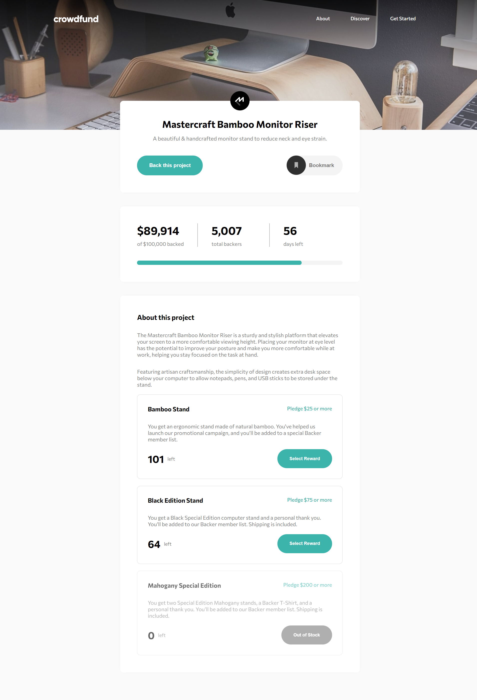
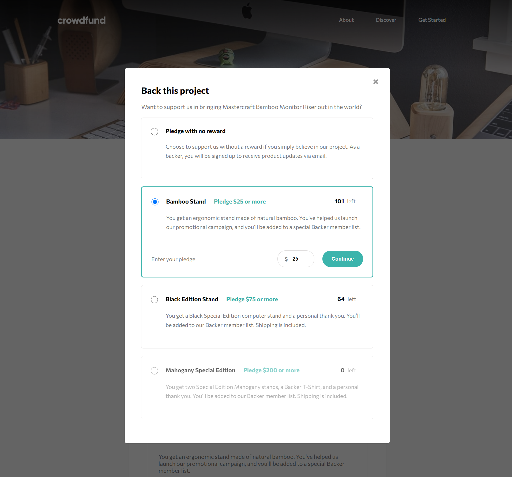
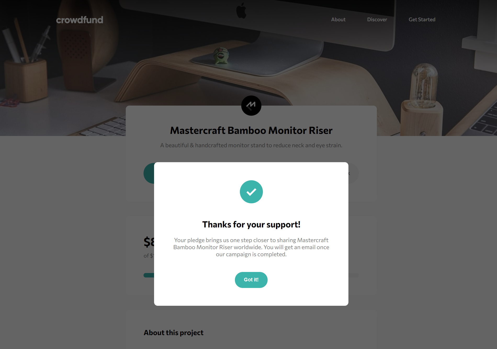

# Frontend Mentor - Crowdfunding product page solution

This is a solution to the [Crowdfunding product page challenge on Frontend Mentor](https://www.frontendmentor.io/challenges/crowdfunding-product-page-7uvcZe7ZR). Frontend Mentor challenges help you improve your coding skills by building realistic projects. 

## Table of contents

- [Overview](#overview)
  - [The challenge](#the-challenge)
  - [Screenshot](#screenshot)
  - [Links](#links)
- [My process](#my-process)
  - [Built with](#built-with)
  - [What I learned](#what-i-learned)
- [Author](#author)

## Overview

### The challenge

Users should be able to:

<!-- - View the optimal layout depending on their device's screen size -->
- See hover states for interactive elements
- Make a selection of which pledge to make
- See an updated progress bar and total money raised based on their pledge total after confirming a pledge
- See the number of total backers increment by one after confirming a pledge
- Toggle whether or not the product is bookmarked

### Screenshot

   
  
   

 

### Links

- Solution URL: [Github Repo Link](https://github.com/akash-10-23/crowdfunding-product-page)
- Live Site URL: [Page hosted on Github Pages](https://akash-10-23.github.io/crowdfunding-product-page/)

## My process
- Made structure of each part using HTML and CSS
- Added JavaScript for functionality

### Built with

- Semantic HTML5 markup
- CSS custom properties
- jQuery
- Simple JavaScript 

### What I learned

- Recalled the basics of frontend development using HTML, CSS and JavaScript.
- Enhanced the knowledge of JavaScript.

## Author

- Website - [Akash Ratan Verma](https://github.com/akash-10-23)
- Frontend Mentor - [@akash-10-23](https://www.frontendmentor.io/profile/akash-10-23)

